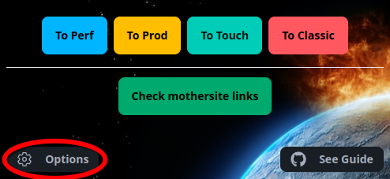
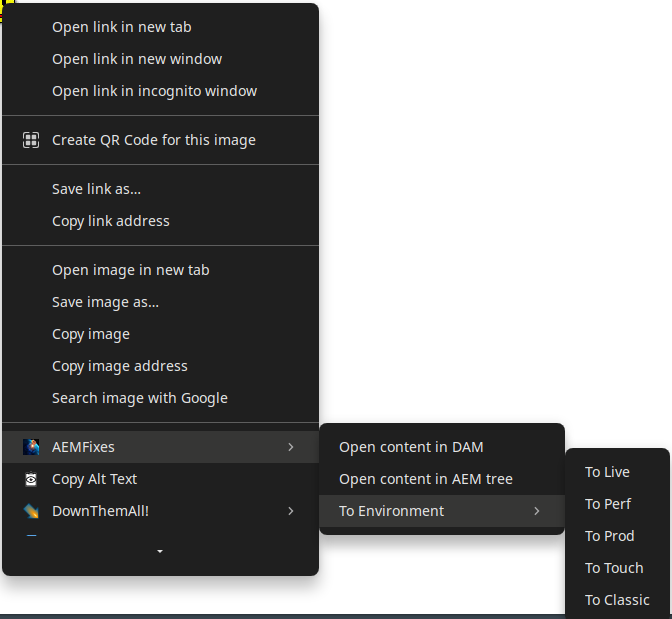

<!--- This README was auto-generated using 'npm run readme' --> 

# AEM Fixes

AEM Fixes is a modern Chrome Extension designed to eliminate repetitive everyday tasks in AEM Engine by automating them.

       

## IMPORTANT

You have to upload a JSON file to use this extension. If you want to have your own settings, look at the `template.json` file. Otherwise, if you need a private file, please contact me via messenger or email.

**_Some functions require their parameters to be enabled in options page_**  

## Features

### Jira page

* Automatically creating WF by adding simple button, in Jira ticket page, matching the interface:  This button will redirect you to create WF page and automatically paste for you ticket number and name
* Auto fix attachment filters to display new content at top 

### Almost all pages that you work on

* Fast transition between environments, so you can jump from Live directly to Author:   

### Author page

* Open Touch properties in a new tab without page reload needed:
* Open author in AEM tree:  
* Showing blocked ticket with link to its parent ticket on the yellow box at the top of the author page

### Live&Perf pages

* Automatically checks for mothersite links on pages, if any, inverts colors of it's link 
* Vehicle config number is showing directly on KMI, TDR etc. pages 

### Workflow page

* Auto insert WF title from the link
* Insert some useful links (DL, Market config, etc...)
* Fixing all links it to be in Touch UI

### DAM Tree

* if you link is MAV in classic DAM tree, will momently open it in new window in touch UI

### Context menu

* Open image directly in DAM
* You can jump to eny environment from browser context menu, without opening page in a new tab

cats and memes about programmers hidden in the depths of the codebase

## Installation

AEM Fixes can be downloaded from the chrome web store https://chromewebstore.google.com/detail/aemfixes/enncmomonbnjkpljcmahbooohommdmnk

Also it can be built from source:

* clone repository
* run `npm install`
* then `npm run build:chrome`
* on `chrome://extensions` page, load unpacked /build folder or use zip file in /zip folder